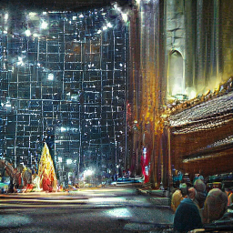
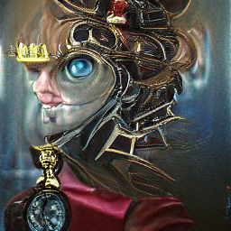

# LocalVQGAN

The classic VQGAN+CLIP (the 2021 Colab aesthetic), rebuilt to run fast and
locally with a web GUI. Apple Silicon (MPS + native MLX), NVIDIA (CUDA), and
CPU. No notebook, no per-session setup, no losing your gallery when the
session dies — ~40x faster than a faithful port of the original code on the
same hardware, with the same math and the same look.

  
  
  

Unretouched output at default settings (300 iterations, 32 cutouts, imagenet_16384). See <a href="PERFORMANCE.md">PERFORMANCE.md</a> for how fast.

## Quick start

LocalVQGAN needs Python >=3.11. Install Python first and make sure `python3`
(macOS/Linux) or `py` (Windows) works from your terminal.

macOS/Linux, from a local clone:

    ./run.sh

Windows, from a local clone:

    run.bat

Either command creates a project-local `.venv`, installs LocalVQGAN, starts the
web app at http://127.0.0.1:8420, and opens a browser tab.

Alternative one-command installs from a local clone, if you already use these
tools:

    pipx install .
    uv tool install .
    uvx --from . localvqgan

Those install a `localvqgan` command on your PATH instead of using this
project's `.venv`.

First use downloads the checkpoint you pick, with `imagenet_16384` as the
default (~934 MB), plus the CLIP model. Downloads are cached one time under
`~/.cache/localvqgan/`; on Windows the code uses the same
`Path.home() / ".cache" / "localvqgan"` location. Output images are written under
`./outputs/<run-id>/`, relative to the folder where you launched the app, with
a `settings.json` sidecar for each run.

On Linux, the normal PyPI PyTorch install can pull CUDA runtime packages for
supported NVIDIA setups; if CUDA is not available, PyTorch falls back to CPU.

## What's different from the Colab

- No per-session setup: models stay loaded in a local server.
- fp16 autocast on MPS/CUDA; batched cutouts (default 32, not 64).
- MPS-native augmentation set — no CPU-fallback ops in the hot loop.
- Live preview streaming, gallery with reusable settings, timelapse MP4
  export, and keyframed zoom/pan animation mode.
- Every image gets a `settings.json` sidecar for exact reproduction.
- On Apple Silicon, an optional MLX engine (`pip install -e ".[mlx]"`) runs the
  same checkpoints natively; pick the engine in the GUI (auto/mlx/torch).

## Credits

This is a from-scratch reimplementation, ported and optimized for local use,
of the generation technique from the community VQGAN+CLIP Colab notebook at
[justinjohn0306/VQGAN-CLIP](https://github.com/justinjohn0306/VQGAN-CLIP)
(`VQGAN+CLIP(Updated).ipynb`) — no notebook code is vendored here, only the
same algorithm (latent optimization against a CLIP loss over augmented
cutouts) and the same default hyperparameters, reproduced to match its 2021
aesthetic. That notebook is itself part of a wider lineage of VQGAN+CLIP
Colab notebooks that popularized the technique in 2021. The underlying
models are from their original publications:

- **VQGAN** — Esser, Rombach & Ommer, ["Taming Transformers for High-Resolution Image Synthesis"](https://github.com/CompVis/taming-transformers) (CVPR 2021).
- **CLIP** — Radford et al., ["Learning Transferable Visual Models From Natural Language Supervision"](https://github.com/openai/CLIP) (OpenAI, 2021).

## Checkpoints

imagenet_1024/16384, gumbel_8192, coco, sflckr, and wikiart_1024/16384
download on demand. faceshq, ade20k, ffhq, and celebahq have no surviving
public mirrors (the original notebook is equally broken for them) — if you
have the files, drop `config.yaml` + `model.ckpt` into
`~/.cache/localvqgan/<name>/` and they'll be picked up.

## Engines

Two generation backends share the same checkpoints and math:

- **torch** — MPS/CUDA/CPU via PyTorch. Always available.
- **mlx** — Apple Silicon only, native Metal via MLX. Optional
  (`pip install -e ".[mlx]"`). Not all checkpoints are supported yet (see
  the capability map in `localvqgan/pipeline/backends/mlx_backend/`).

Pick `torch`, `mlx`, or `auto` per generation in the GUI/API. `auto` prefers
mlx whenever it's installed, supports the requested checkpoint, and meets
the measured speed gate; otherwise it falls back to torch.
The `precision` setting applies to the torch engine only — on mlx, canvases
up to 256x256 run the VQGAN in fp32 (the historic behavior, bit-stable
seeds) and larger canvases run it in bf16 with chunked cutout evaluation
and a bounded Metal cache, which is what makes them fit in unified memory
at all (see `PERFORMANCE.md`). CLIP is fp16 everywhere.

Measured on an Apple M1 16 GB (imagenet_16384/ViT-B-32, 32 cutouts, steady
state, 2026-07-07):

| size    | torch    | mlx      |
|---------|----------|----------|
| 256x256 | 0.680 it/s | 0.929 it/s (1.37x) |
| 512x512 | 0.010 it/s or DNF (working set exceeds 16 GB) | 0.16–0.25 it/s |

The speed gate (`MLX_MEETS_SPEED_GATE`) is evaluated at 256x256/32cut
(ratio >= 1.2 to prefer mlx in `auto`); it currently passes at 1.37x. At
512x512 torch cannot keep its working set resident on 16 GB and collapses
into swap, while the mlx large-canvas path is memory-bounded by
construction — so `auto` routes every supported size to mlx. The 512x512
spread (0.16–0.25) tracks ambient memory pressure; results are
deterministic (identical loss across all benchmark runs). On machines with
more unified memory, torch at 512x512 should behave like its 0.284 it/s
compute profile suggests. The earlier 1.021 it/s MLX number was invalidated
by a half-precision NaN bug, fixed and re-measured; see `PERFORMANCE.md`.

## Dev

    .venv/bin/pytest            # fast suite
    .venv/bin/pytest -m slow    # downloads models, runs real generation
