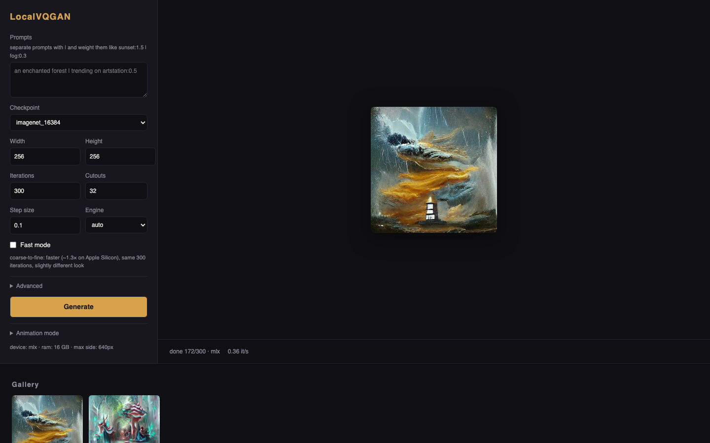

# LocalVQGAN

The classic VQGAN+CLIP (the 2021 Colab aesthetic), rebuilt to run fast and
locally with a web GUI. Apple Silicon (MPS + native MLX), NVIDIA (CUDA), and
CPU. No notebook, no per-session setup, no losing your gallery when the
session dies. The project's reference Apple M1 benchmark reports ~40x the
iteration speed of a faithful, unoptimized port on that same machine;
this is a project measurement, not an independently reproduced result or
a comparison with a Colab GPU. See [PERFORMANCE.md](PERFORMANCE.md) for
the workload, hardware, optimization history, and fidelity checks.

  
  
  

Unretouched output at default settings (300 iterations, 32 cutouts, imagenet_16384). See <a href="PERFORMANCE.md">PERFORMANCE.md</a> for how fast.

  

## Contents

- [Quick start](#quick-start) and [launch options](#launch-options)
- [What's different from the Colab](#whats-different-from-the-colab)
- [Credits](#credits)
- [Checkpoints](#checkpoints) and [engines](#engines)
- [Troubleshooting](#troubleshooting)
- [Development](#dev), [contributing](CONTRIBUTING.md),
  [performance log](PERFORMANCE.md), and [release notes](CHANGELOG.md)

## Quick start

LocalVQGAN needs Python 3.11 or newer and internet access for the initial
dependency and model downloads. Start with the default 256x256 canvas;
larger images need more memory, and CPU generation is slower.

Clone the repository and enter its folder (or download and extract its ZIP):

    git clone https://github.com/RasputinKaiser/LocalVQGAN.git
    cd LocalVQGAN

macOS/Linux, from a local clone:

    ./run.sh

Windows Command Prompt, from a local clone:

    run.bat

In PowerShell, use `.\run.bat`.

Either command finds a suitable Python on your machine, creates a
project-local `.venv`, installs LocalVQGAN into it, starts the web app at
http://127.0.0.1:8420, and opens a browser tab. If that port is occupied,
use the URL printed in the terminal. On Apple Silicon the install is slim:
it gets the native MLX engine and skips the ~2 GB PyTorch stack entirely
(the historic torch checkpoints are read with a numpy-only loader,
converted once, and cached).
Everywhere else the PyTorch engine installs as before. If no Python 3.11+ is
found, the script stops with a direct link to install one instead of failing
with a confusing error. Re-running either script later just launches the
app — the dependency install only happens once.

Alternative one-command installs from a local clone, if you already use these
tools:

    pipx install .
    uv tool install .
    uvx --from . localvqgan

`pipx install` and `uv tool install` install a `localvqgan` command on your
PATH instead of using this project's `.venv`. `uvx` runs it in a
tool-managed environment.

### Generate your first image

1. Keep `imagenet_16384` selected and click **Download checkpoint** if it
   isn't cached yet (~934 MB). Wait for the download to finish before
   generating. Some other checkpoints are several GB; the menu shows
   approximate sizes.
2. Enter a prompt, for example `an enchanted forest, oil painting`.
   Multiple prompts use `|`, with optional weights:
   `sunset:1.5 | fog:0.3`.
3. Leave the default 256x256 canvas, 300 iterations, 32 cutouts, and
   **Fast mode** off for the original recipe. Click **Generate**. The first
   run also fetches CLIP and, on MLX, converts and caches model weights,
   so the initial loading phase takes longer than later runs.
4. Find the finished image in the gallery. **PNG**, **MP4**, and **JSON**
   open the image, timelapse, and saved settings; **Reuse** fills the form
   with the saved settings and resolved random seed. Reselect any original
   init-image or image-prompt upload when reusing an image-guided run.

**Queue next** adds another job while one is running. **Batch** (under
Advanced) queues up to 16 seeds. **Stop** cancels the current job and
clears all queued jobs. Closing the browser tab leaves the server running;
stop it with Ctrl+C in the launch terminal. The queue is in memory and does
not survive a server restart.

### Where files live

VQGAN checkpoints and converted MLX weights are cached under
`~/.cache/localvqgan/`; on Windows the code uses the same
`Path.home() / ".cache" / "localvqgan"` location. The MLX CLIP download also
uses Hugging Face's cache. Keep the caches to avoid downloading and
converting again.

Output images are written under `./outputs/<run-id>/`, with `final.png`,
preview frames, and a `settings.json` sidecar for each completed run.
The launch scripts switch to the repository folder, so their default
gallery lives in the clone's `outputs/`. A directly invoked `localvqgan`
command uses the current working directory. The gallery's delete button
removes that run's files; copy any images you want to keep first.

### Launch options

After the launch script has installed the app, invoke the command directly
to pass options (the scripts don't forward arguments):

macOS/Linux:

    .venv/bin/localvqgan --port 8421 --outputs "$HOME/LocalVQGAN-output" --no-browser

Windows PowerShell:

    .\.venv\Scripts\python.exe -m localvqgan --port 8421 --outputs "$HOME\LocalVQGAN-output" --no-browser

If you used `pipx` or `uv tool install`, use `localvqgan` directly.
`--port` sets the preferred port (the server searches the following ports
if needed), `--outputs` selects a persistent gallery folder, and
`--no-browser` suppresses the automatic tab. `localvqgan --help` lists the
options. The server binds to `127.0.0.1` for use on the same computer.

On Linux, the normal PyPI PyTorch install can pull CUDA runtime packages for
supported NVIDIA setups; if CUDA is not available, PyTorch falls back to CPU.

## What's different from the Colab

- No per-session setup: models stay loaded in a local server.
- fp16 model weights on MPS/CUDA; batched cutouts (default 32, not 64).
- MPS-native augmentation set — no CPU-fallback ops in the hot loop.
- Live preview streaming, gallery with reusable settings, timelapse MP4
  export, and keyframed zoom/pan animation mode.
- A job queue with a batch control: queue a handful of draft seeds, walk
  away, then one-click **Upscale 2×** the keeper — re-rendered at double
  size from the draft as init image (the classic 2021 upscale idiom).
- Opt-in **Fast mode**: the same 300 iterations run coarse-to-fine
  (~1.3x faster on Apple Silicon) with the look preserved in distribution —
  off by default because it changes the exact per-seed pixels.
- Completed runs get a `settings.json` sidecar for reproduction —
  including the seed actually drawn on random-seed runs (`seed_used`), so
  Reuse restores that seed rather than drawing a new one. Use the same
  engine, settings, model files, input images, and environment when comparing outputs;
  changing engines, precision, canvas size, or Fast mode can change pixels.
- On Apple Silicon, the native MLX engine is the default install — same
  checkpoints, same math, no PyTorch dependency; pick the engine in the GUI
  (auto/mlx/torch — see [Engines](#engines) to add torch to a slim install).

## Credits

This is a from-scratch reimplementation, ported and optimized for local use,
of the generation technique from the community VQGAN+CLIP Colab notebook at
[justinjohn0306/VQGAN-CLIP](https://github.com/justinjohn0306/VQGAN-CLIP)
(`VQGAN+CLIP(Updated).ipynb`) — no notebook code is vendored here, only the
same algorithm (latent optimization against a CLIP loss over augmented
cutouts) and the same default hyperparameters, reproduced to match its 2021
aesthetic. That notebook is itself part of a wider lineage of VQGAN+CLIP
Colab notebooks that popularized the technique in 2021. The underlying
models are from their original publications:

- **VQGAN** — Esser, Rombach & Ommer, ["Taming Transformers for High-Resolution Image Synthesis"](https://github.com/CompVis/taming-transformers) (CVPR 2021).
- **CLIP** — Radford et al., ["Learning Transferable Visual Models From Natural Language Supervision"](https://github.com/openai/CLIP) (OpenAI, 2021).

## Checkpoints

imagenet_1024/16384, gumbel_8192, coco, sflckr, and wikiart_1024/16384
are listed for on-demand download through the GUI. faceshq, ade20k, ffhq,
and celebahq are marked `mirror_offline` in the checkpoint registry, so
automatic downloads are disabled for them. If you already have trusted
files, place `config.yaml` + `model.ckpt` in
`~/.cache/localvqgan/<name>/` and they'll be picked up. Checkpoint availability
and MLX compatibility are separate: manually installed checkpoints outside
the MLX support list still need the torch engine.

## Engines

Two generation backends share the same checkpoints and math:

- **torch** — MPS/CUDA/CPU via PyTorch. The default install everywhere
  except Apple Silicon; there it's the `[torch]` extra
  (needed for Gumbel checkpoints, which MLX doesn't support).
- **mlx** — Apple Silicon only, native Metal via MLX; the default (and
  torch-free) install there. Supports `imagenet_1024`, `imagenet_16384`,
  `wikiart_1024`, `wikiart_16384`, `coco`, and `sflckr`, with `ViT-B-32`
  or `ViT-B-16` CLIP. The source of truth is the
  [capability map](localvqgan/pipeline/backends/mlx_backend/__init__.py).

To add torch to a clone installed by the launch scripts, stop the server,
run the matching command from the repository folder, then restart it:

macOS/Linux:

    .venv/bin/python -m pip install -e ".[torch]"

Windows PowerShell:

    .\.venv\Scripts\python.exe -m pip install -e ".[torch]"

Pick `torch`, `mlx`, or `auto` per generation in the GUI/API. `auto` prefers
mlx whenever it's installed, supports the requested checkpoint, and meets
the build's measured speed gate; otherwise it falls back to torch **if
torch is installed**. The slim Apple-Silicon install has no torch fallback
until you add the extra. This gate is based on the recorded reference
benchmark, not a benchmark run automatically on your machine.
The `precision` setting applies to the torch engine only — on mlx, canvases
with at most 256x256 pixels run the VQGAN in fp32 (the historic behavior,
bit-stable seeds). Larger canvases use bf16 and a bounded Metal cache;
cutout evaluation is chunked above 384x384 pixels to control memory use
on the reference machine (see `PERFORMANCE.md`). MLX CLIP is fp16; torch
precision `auto` selects fp16 on MPS/CUDA and fp32 on CPU, with an fp32
retry for certain first-iteration failures.

Measured on an Apple M1 16 GB (imagenet_16384/ViT-B-32, 32 cutouts, steady
state, 2026-07-07):

| size    | torch    | mlx      |
|---------|----------|----------|
| 256x256 | 0.680 it/s | 0.929 it/s (1.37x) |
| 512x512 | 0.010 it/s or DNF (working set exceeds 16 GB) | 0.16–0.25 it/s |

The speed gate (`MLX_MEETS_SPEED_GATE`) is evaluated at 256x256/32cut
(ratio >= 1.2 to prefer mlx in `auto`); it currently passes at 1.37x. At
512x512, in that benchmark, torch could not keep its working set resident
on 16 GB and collapsed into swap, while the mlx large-canvas path bounded
its memory use. The current dispatcher routes every supported size to mlx
when the speed gate passes. The 512x512 spread (0.16–0.25) tracks ambient
memory pressure; results are
deterministic (identical loss across all benchmark runs). On machines with
more unified memory, torch at 512x512 should behave like its 0.284 it/s
compute profile suggests. The earlier 1.021 it/s MLX number was invalidated
by a half-precision NaN bug, fixed and re-measured; see `PERFORMANCE.md`.
These are historical measurements, not a performance guarantee on other
hardware or dependency versions. The current torch engine also uses
decoder gradient checkpointing above 384x384 pixels to reduce memory use;
the table predates that change.

## Troubleshooting

- **No suitable Python:** install Python 3.11+ from
  [python.org](https://www.python.org/downloads/) and ensure it is on PATH.
  On Windows, the launcher also checks the `py` launcher.
- **Install was interrupted, or dependencies changed after a pull:** the
  launch scripts skip installation when the `.venv` interpreter exists.
  Repair it from the repository folder with `.venv/bin/python -m pip install -e .`
  (Windows: `.\.venv\Scripts\python.exe -m pip install -e .`), then rerun the
  launcher. Use `.[torch]` or `.[dev]` if you need those extras.
- **Browser didn't open / 8420 is busy:** open the exact URL printed in the
  terminal. You can choose another preferred port with the direct command
  shown in [Launch options](#launch-options).
- **Missing checkpoint / file-not-found error on first generation:** click
  **Download checkpoint** and wait for completion before generating. For
  entries marked mirrors offline, use the manual placement in
  [Checkpoints](#checkpoints). Downloading CLIP and MLX conversion can add
  time to the first run even after the checkpoint is ready.
- **Unsupported MLX checkpoint / torch fallback missing:** use a supported
  checkpoint or install the `[torch]` extra, restart, and select `torch` or
  `auto`. MLX requires a native Apple-Silicon macOS Python (`arm64`);
  an Intel/Rosetta interpreter uses the torch installation path.
- **Out of memory or steadily slowing iterations:** return to 256x256 and
  close other GPU-heavy apps. If necessary, lower size or cutouts explicitly;
  those changes affect the recipe. The GUI's RAM-based size recommendation
  is a guardrail, not a guarantee that every checkpoint will fit.
- **Gallery appears empty after relaunch:** check the output folder. Use
  the same working directory or the same explicit `--outputs` path across
  launches; model caches and the gallery are different folders.

For a bug report, include the OS, Python version, engine/device shown in
the app, checkpoint, canvas size, error text, and reproduction steps.
See [CONTRIBUTING.md](CONTRIBUTING.md) for tests and reporting guidance.

## Dev

The launcher installs runtime dependencies only. Follow the
[development setup](CONTRIBUTING.md#development-setup) to add pytest and
Ruff before running checks:

    python -m pytest -q --timeout 120    # default selection excludes slow tests
    python -m pytest -q -m slow         # model/parity and generation checks
    python -m ruff check .

See [CONTRIBUTING.md](CONTRIBUTING.md) for the ground rules (fidelity gates,
performance-claim policy) and [CHANGELOG.md](CHANGELOG.md) for release notes.
